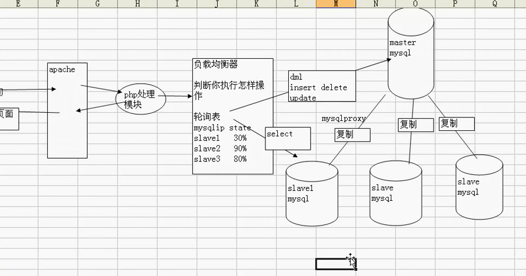

#### 视频
* [链接](https://pan.baidu.com/s/1pmoWyPPYgbxbl9yDe5hFhQ) 密码: 82hm

----
#### 水平分割： [sharding-jdbc](http://shardingjdbc.io/)

````
  原则：
      1，表结构一样；
      2，根据用户id%3 = 值，根据这个值来决定这个用户在哪个表；
      2，查询的时候：获取表名
         tablename = 'xxxx'+id%3;
         select * from tablename
  我们在提供检索时，应该根据用户的业务需求，找到分表的标准，并在检索页面约束用户的检索方式；（一定要找到分割的标准，满足大多数用户、频繁使用的用户）
````

##### 垂直分割

````
   根据需求把一张表的结构分成两张结构不一样表；（把某些字段提出去，表结构发生了变化）
   把某个表的某些字段，这些字段，要查询时，并不是已经关系，但是数据量很大，我们建议大家可以，把这些字段单独到放到另外一张表，从而提高效率；
````

##### 读写分离

````
如果数据库压力很大，一台机器支撑不下了，那么可以用mysql复制实现多台机器同步，将数据库的压力分散；
````
* 读写分离原理：


##### mysql常用命令

````
  配置环境变量：
    1,open ~/.bash_profile 
    2,
    alias mysql=/usr/local/mysql/bin/mysql
    alias mysqladmin=/usr/local/mysql/bin/mysqladmin
    3,source ~/.bash_profile
  登陆：mysql -u username -p   //要配置环境变量后才能这样搞
  
  查看日志是否开启或日志文件保存路径：SHOW VARIABLES LIKE 'general%';  
      general_log：日志功能是否开启，默认关闭OFF  //general_log的值为ON则为开启，为OFF则为关闭
      general_log_file：日志文件保存位置
  
  开启日志查询：set GLOBAL general_log='ON'; //general_log的值为ON则为开启，为OFF则为关闭
  
  显示数据库版本：SHOW VARIABLES LIKE '%version%';
  
  设置通用日志输出为表方式： set global log_output='TABLE';//存储在数据库中的mysql.general_log
  
 
  上述命令只对当前生效，当MySQL重启失效
  
````

##### Mysql如何开启慢查询

````
  查看当前慢查询日志的开启情况:SHOW VARIABLES LIKE '%quer%';
  重要参数说明：
     slow_query_log的值为ON为开启慢查询日志，OFF则为关闭慢查询日志。
     slow_query_log_file 的值是记录的慢查询日志到文件中
     long_query_time 指定了慢查询的阈值
     log_queries_not_using_indexes 如果值设置为ON 
     
     
  开启慢查询：set GLOBAL  slow_query_log = 'ON';
  设置慢查询的阀值为: set GLOBAL long_query_time = 0.1;   //单位为秒
  查询慢查询的阀值：show global variables like 'long_query_time%';
  设置日志输出到表中：set GLOBAL log_output='TABLE';
  设置日志文件路径：set global general_log_file='/tmp/general.log';
  查询日志的输出方式：show variables like '%log_output%';
  查询当前慢查询语句的个数： show global status like '%slow';
  查询有哪些系统表： show tables;//要选中mysql(使用use mysql;)，这样可以看到日志相关的表
  
  
  测试一下慢查询：
     SELECT sysdate(), sleep(10), sysdate();//花费10s执行一条select
  
  查询最耗时间的SQL: 
  select * From slow_log order by query_time desc limit 10;
  SELECT start_time, query_time, sql_text FROM slow_log order by query_time desc limit 10;
  
  
  
````

##### 数据库连接查询

````
  显示连接列表：show processlist;
  查询数据库当前设置的最大连接数：show variables like '%max_connections%';
  显示当前连接数：show status like 'Threads%';
  显示连接状态：SHOW STATUS LIKE '%connect%';
````