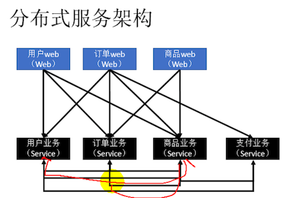
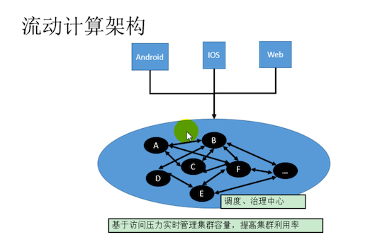
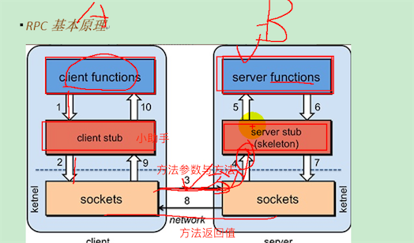
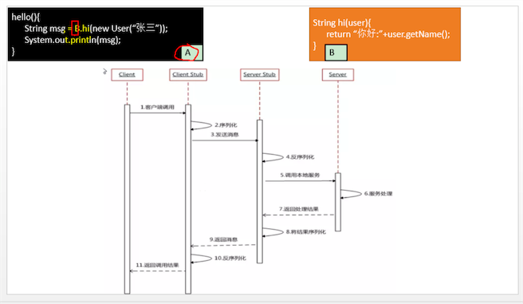
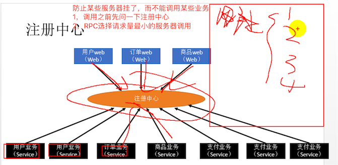
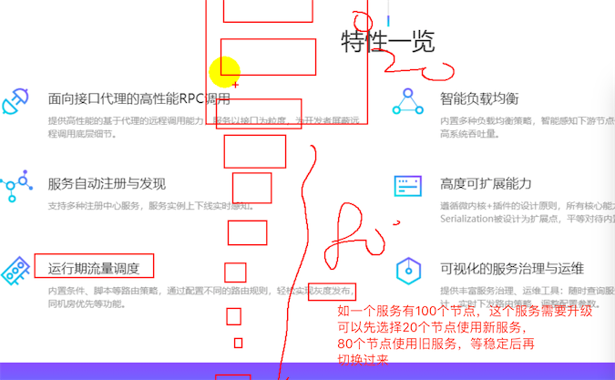
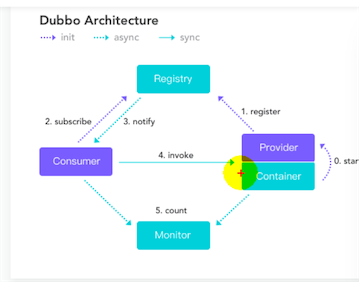
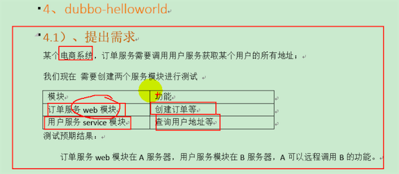

#####  [dubbo.docx](doc/尚硅谷-dubbo.docx)
#####  [dubbo 官方文档](http://dubbo.apache.org/zh-cn/)

* 分布式应用架构演变：单一应用->垂直应用(按模块拆分成多个应用)
* 单一应用缺点：打包不方便、不好扩展
* 垂直应用优点：易扩展
* 垂直应用缺点：一个模块包括界面、业务逻辑实现，两者没有分开（改了页面需要重新打包）；应用不可能完全独立，大量的应用之间需要交互
* 分布式架构：把核心业务逻辑与用户业务分别抽取出来 ,这样的话，用户业务与核心业务之间的调用需要借助RPC（远程过程调用）
* 分布式架构流动计算架构：，根据模块的访问量动态配置服务器的数目；


## RPC简介
* 基本原理：,例如：

````
  评判RPC框架：
  1，AB建立连接的时间要短
  2，序列化与反序列化要快
````

* dubbo

* 灰度发布：

* dubbo架构：注册中心、服务提供者、服务消费者、框架窗口(Container)、监控中心 

````
  运行流程：
  1，dubbo架构启动，容器启动
  2，服务提供者将服务注册到注册中心
  3，服务消费者启动后，从注册中心订阅服务
  4，如果某个服务下线了，注册中心可以与服务消费者保持长连接，注册中心将消息推送到消费者
  5，消费者同步调用提供者的功能
  6，每隔一分钟将信息到监控中心
  
  开发步骤：
  1，开发提供者
  2，注册中心注册
  3，消费者
````

#### 开发环境搭建
* [搭建注册中心](http://dubbo.apache.org/zh-cn/docs/user/references/registry/introduction.html)  、 [zookeeper](http://zookeeper.apache.org/) 、 [zookeeper mac安装](https://blog.csdn.net/qi49125/article/details/60779877)
* [搭建监控中心](https://github.com/apache/incubator-dubbo-ops)

````
  注意：
    注意安装Mavean环境
    可能需要修改zookeeper地址与端口号
    需要先启动zookeeper服务器
````

##### 创建服务提供者、消费者，需求：  ，[服务的编写规范可以参考](http://dubbo.apache.org/zh-cn/docs/user/best-practice.html)
* [服务提供者代码参考](code/user-service-provider)
* [服务消费者代码参考](code/order-service-consumer)
* [接品制取](code/gmall-interface)，将消费者与提供者需要的公共接口，单独抽到一个工程中；

````
  1，将服务提供者注册到注册中心核心步骤
      1）,导入dubbo依赖。可以在pom文件中引入
      2），由于注册中心我们使用的是zookeeper，所以我们要引入操作zookeeper的客户端的依赖。可以在pom中导入
      3），配置服务提供者，参考后面；
      4)，启动spring容器，到监控中心页面可以看对应的服务与应用
  2，让服务消费者去注册中心订阅服务提供者的服务地址核心步骤
      1），导入dubbo依赖。可以在pom文件中引入
      2），消费者中心配置，参考后面；注意：接口名称要与提供者的接口一样
      3），启动spring容器，测试
      
  System.in.read();测试的时候让程序阻塞，否则程序执行完马上就退出了，到控制台就看不到效果了    
     
````

* [dubbo服务提供者配置参考](code/user-service-provider/src/main/resources/provider.xml)
*  [dubbo消费中心配置](code/order-service-consumer/src/main/resources/consumer.xml)

##### 安装监控中心 dubbo-monitor-smiple
* dubbo-monitor-smiple监控服务的调用情况,[安装地址](https://github.com/apache/incubator-dubbo-ops) ，[参考](https://blog.csdn.net/goldenfish1919/article/details/69502898)；最后配置在消费者、提供者配置文件里面配置监控中心

##### 整合spring boot,[提供者工程代码](code/boot-user-service-provider) [消费者工程代码](code/boot-order-service-consumer)

````
 Spring boot的配置方式：
  1，将服务提供者注册到注册中心核心步骤
      1）,导入dubbo依赖。可以在pom文件中引入
      2），由于注册中心我们使用的是zookeeper，所以我们要引入操作zookeeper的客户端的依赖。可以在pom中导入
      3），导入dubbo-spring-boot-starter依赖 ；如果要暴露的服务很多，也可以通过注解配置要暴露的服务
      4)，在主程序中开启@EnableDubbo，开启基于注解的dubbo功能；启动spring容器，到监控中心页面可以看对应的服务与应用
  2，让服务消费者去注册中心订阅服务提供者的服务地址核心步骤
      1），导入dubbo依赖。可以在pom文件中引入
      2），消费者中心配置，参考后面；需要消费哪个服务采用@Reference注解方式在代码里面配置
      3），启动spring容器，测试
      
  System.in.read();测试的时候让程序阻塞，否则程序执行完马上就退出了，到控制台就看不到效果了    
     
````

* [spring boot dubbo服务提供者配置参考](code/boot-user-service-provider/src/main/resources/provider.xml)
* [spring boot dubbo消费中心配置](code/boot-order-service-consumer/src/main/resources/application.properties)


##### [dubbo配置文件 ](http://dubbo.apache.org/zh-cn/docs/user/references/xml/introduction.html)