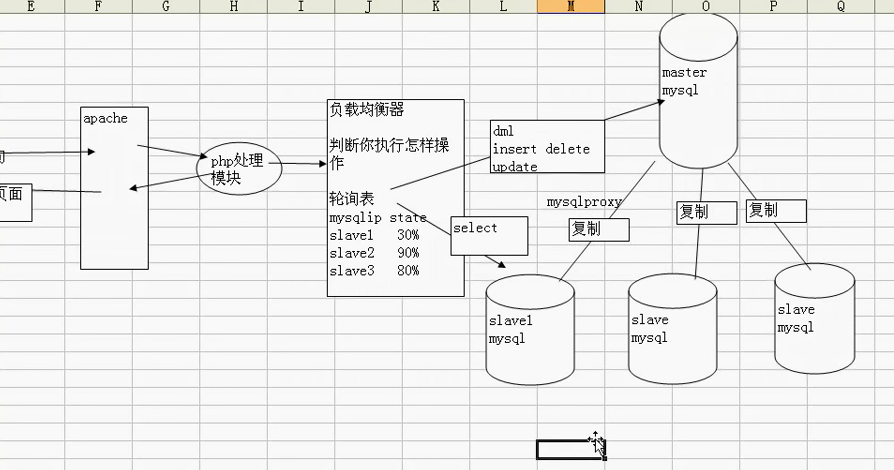

####水平分割： [sharding-jdbc](http://shardingjdbc.io/)

````
  原则：
      1，表结构一样；
      2，根据用户id%3 = 值，根据这个值来决定这个用户在哪个表；
      2，查询的时候：获取表名
         tablename = 'xxxx'+id%3;
         select * from tablename
  我们在提供检索时，应该根据用户的业务需求，找到分表的标准，并在检索页面约束用户的检索方式；（一定要找到分割的标准，满足大多数用户、频繁使用的用户）
````

#####垂直分割

````
   根据需求把一张表的结构分成两张结构不一样表；（把某些字段提出去，表结构发生了变化）
   把某个表的某些字段，这些字段，要查询时，并不是已经关系，但是数据量很大，我们建议大家可以，把这些字段单独到放到另外一张表，从而提高效率；
````

#####读写分离

````
如果数据库压力很大，一台机器支撑不下了，那么可以用mysql复制实现多台机器同步，将数据库的压力分散；
````
* 读写分离原理：
